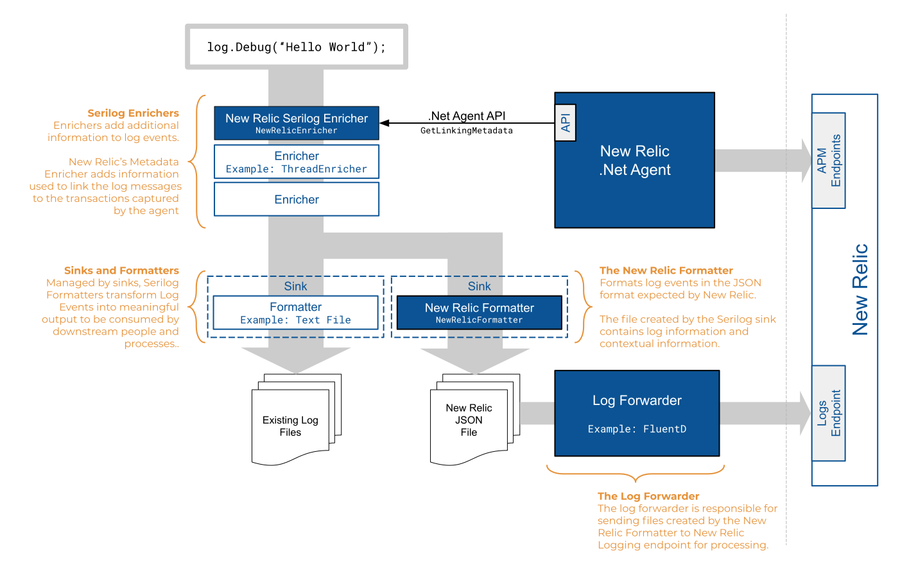

# New Relic .Net Logging Extensions for Serilog
The .Net Extensions for Serilog will add contextual information from the .Net Agent to Application Log Messages, output them in the New Relic's expected JSON format, and send them to the New Relic Logging endpoint.


## Minimum Requirements

* Microsoft <a target="_blank" href="https://dotnet.microsoft.com/download/dotnet-framework">.Net Framework 4.5+</a> or  <a target="_blank" href="https://dotnet.microsoft.com/download/dotnet-core">.Net Core 2.0+</a>
* <a target="_blank" href="https://docs.newrelic.com/docs/release-notes/agent-release-notes/net-release-notes">New Relic .Net Agent 8.18+<a>
* <a target="_blank" href="https://docs.newrelic.com/docs/agents/net-agent/net-agent-api" target="_blank">New Relic .Net Agent API 8.18+</a>
* <a target="_blank" href="https://serilog.net/">Serilog 2.5+</a>
* <a target="_blank" href="https://www.nuget.org/packages/Serilog.Sinks.File/">Serilog File Sinks v4.0+</a>

###### Recommended Components
* <a target="_blank" href="https://www.nuget.org/packages/Serilog.Sinks.Async"> Serilog Asynchronous Wrapper for Sinks</a>
* <a target="_blank" href="https://www.fluentd.org/download">Fluentd</a> and <a target="_blank" href="https://github.com/newrelic/newrelic-fluentd-output">New Relic's Plugin for Fluentd</a> 


## Overview
When application code logs a message, Serilog creates a ```LogEvent```.  Serilog can add additional information to Log Events using Enrichers.  Sinks and Formatters format and output Log Events for downstream consumption and/or viewing.  The New Relic Log Forwarder monitors an output folder and incrementally sends log information to New Relic.



#### New Relic Enricher
The ```NewRelicEnricher``` adds contextual information from the .Net Agent (using the API) to the Log Events generated by the application.  This contextual information, known as Linking Metadata, is used by New Relic to link log messages to the transactions and spans from which they were created.

#### New Relic Formatter and Sink
The ```NewRelicFormatter``` translates enriched Log Events into the JSON format expected by New Relic.  A ```Sink``` instructs Serilog to output the JSON to a file in the location that the Log Forwarder expects.

#### New Relic Log Forwarder
The Log Forwarder monitors an output folder and incrementally sends New Relic formatted Log information to the New Relic Logging Endpoint.  There are many log-forwarders available.  For our examples, we will use <a href="https://www.fluentd.org/" target="_blank">fluentd</a>.


## Configuration


#### Configuring the New Relic Enricher
Configure the ```NewRelicEnricher``` by adding the ```NewRelicEnricher``` to the Serilog configuration as described below.  There are no configuration options for the ```NewRelicEnricher```.

```csharp

    var loggerConfig = new LoggerConfiguration()
        
    loggerConfig
        .Enrich.WithNewRelicLogsInContext();

```

It is common to have multiple enrichers adding information to log messages.  In this example, two additional enrichers append Thread Id and Name to the Log Events generated by the application code.  When adding additional enrichers, it is recommended to configure the NewRelicEnricher as the last enricher.

```csharp

    var loggerConfig = new LoggerConfiguration()
        
    loggerConfig
        .Enrich.WithThreadName()
        .Enrich.WithThreadId()    
        .Enrich.WithNewRelicLogsInContext();
        
```
<br/>

#### Configuring the New Relic Formatter and Serilog Output Sink
Below is an example configuration using a basic Serilog File Output Sink with  the ```NewRelicFormatter```.

```csharp

    var loggerConfig = new LoggerConfiguration()
        
    loggerConfig
        .Enrich.WithThreadName()
        .Enrich.WithThreadId()    
        .Enrich.WithNewRelicLogsInContext()
        .WriteTo.File(
            formatter: new NewRelicFormatter(), 
            path: @"C:\logs\SerilogExample.log.json");

    var log = loggerConfig.CreateLogger();

```

Since the JSON files are written to disk, some of these <a href="https://github.com/serilog/serilog-sinks-file" target="_blank">configuration options</a> may be useful in managing the amount of disk space used and/or the performance of the Sink.

* ```restrictedToMinimumLevel```
* ```buffered```
* ```rollingInterval```
* ```rollOnFileSizeLimit```
* ```retainedFileCountLimit```

Though not required, using the <a href="https://www.nuget.org/packages/Serilog.Sinks.Async" target="_blank">Serilog Asynchronous Sink Wrapper</a> may help improve the performance by performing formatting and output of log files to a different thread.
<br/>

#### Configuring the fluentd Log Forwarder
Based on the Fornatter and Sink Configuration described above, the following Fluentd configuration can be used to send logs to New Relic.


```xml
<!--NewRelicLoggingExample.conf-->
<source> 
    @type tail 
    path C:\logs\SerilogExample.log.json
    pos_file C:\logs\SerilogExample.log.json.pos 
    tag logfile.*
 <parse> 
    @type json 
</parse>
</source>
<match **> 
    @type newrelic 
    license_key <YOUR NEW_RELIC_LICENSE_KEY>
    base_uri https://log-api.newrelic.com/log/v1
</match>
```

<br/>

### Applying Context to Log Events


##### Automatic Properties
In addition to the linking metadata obtained from the .Net Agent, the ```NewRelicFormatter``` automatically adds the following properties, if applicable, to each ```LogEvent```.

* Timestamp
* Error Message
* Error Class
* Error Stack Trace
* Message Text
* Message Template
* Log Level
<br/>

##### Other Common Properties
Other enrichers may be used to provide additional contextual information.  For enrichers that provide the following fields, the New Relic Formatter should be configured to identify these properties.

* Thread Id
* Thread Name
* File Name
* Namespace
* Class Name
* Method Name
* Line Number
  
In this example configuration, the ThreadId and ThreadName enrichers add the additional properties ```ThreadId``` and ```ThreadName``` to each ```LogEvent```.  Correspondingly, the ```NewRelicFormatter``` is configured to identify these fields.

```csharp

    var loggerConfig = new LoggerConfiguration()
        
    loggerConfig
        .Enrich.WithThreadName()                                                            //Captures the Thread Id and adds it as the "ThreadId" property to the LogEvent
        .Enrich.WithThreadId()                                                              //Captures the Thread Name and adds it as the "ThreadName" property to the LogEvent
        .Enrich.WithNewRelicLogsInContext()
        .WriteTo.File(
            path: @"C:\logs\SerilogExample.log.json",
            formatter: new NewRelicFormatter()
                .WithPropertyMapping("ThreadId", NewRelicLoggingProperty.ThreadId)          //Identifies the "ThreadId" Property on the Log Event as the Thread Id
                .WithPropertyMapping("ThreadName", NewRelicLoggingProperty.ThreadName)      //Identifies the "ThreadName" Property on the Log Event as the Thread Name
        );

    var log = loggerConfig.CreateLogger();

```
<br/>

##### Custom Message Properties
The ```NewRelicFormatter``` automatically adds all custom properties to Log Events.  These properties are visible in New Relic Logging under the "Message Properties" section.  There are two methods of adding custom properites: (1) a custom enricher; or (2) a message template.

For exmple, the following log message template will result in the custom properties of ```FirstName``` and ```nbr```

```csharp
    log.Debug("Hello {FirstName}, you are number {nbr} on my list", "Bob", 32);
```